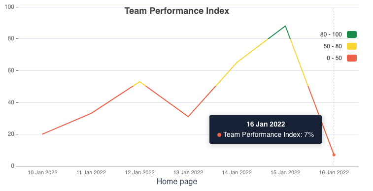
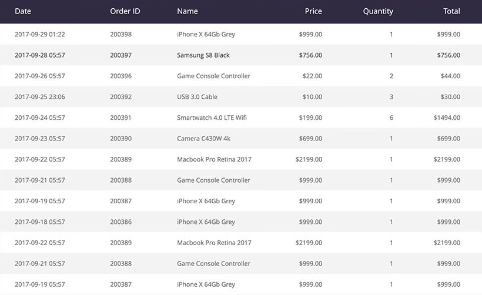

# Instabug take-home task

### Description
You recently joined a firm that uses an internal system to track the performance of its sales team. They currently have an old dashboard built in Angularjs, but they want to add some missing and new features, so they started migrating to Vuejs and used ngVue as a bridge between the two.
There are two pages in the application.
- On the home page, there is a table that names all members of the sales team.
- the performance-chart page, which provides a simple chart showing the team's performance during the previous week.

below are the steps to install the dashboard and a the list of requirements.

### Installation
- copy the content of compressed file, then navigate to the output folder.
- run `yarn install`
- run `yarn start`

### Employee list request
endpoint: https://fe-task.getsandbox.com/employees
method: GET
params:
  - `?page` [int]: number of current page, if not passed will return the first page
  - `?isPartTime` [bool]: return only part time employees, if not passed, will return all employees

response:
```
{
    pages: TOTAL_PAGES_COUNT,
    current_page: CURRENT_PAGE_NUMBER,
    employees: LIST_OF_EMPLOYEES
}
```

### Requirements
You should commit the code to a repository and complete the following steps in separate PRs.

#### Req #1: Chart Edits (VueJS):
  - A chart built with the [echarts](https://echarts.apache.org/en/index.html) library can be found on the page `/team-performance`.
  1. The graph currently displays static data; fetch new data from endpoint 'https://fe-task.getsandbox.com/performance', retrieve the data from the endpoint using Vuex and Axios to retrieve the data from the endpoint and replace it with the static data already set.
  2. To select a specific range on the chart, create a date range filter and filter the chart locally.
  - You can use [this component](https://element.eleme.io/#/en-US/component/date-picker#date-range) or any other date range component you choose, or you can make a simple two-text box with date validation and manually enter the date.
  3. For the filter component, write unit tests (jest is already included in dependencies)
  4. To implement the following, check the library documentation:
  a. The chart line should be styled to reflect the design below, and the graph line should indicate the performance ranges.
    - Red: For a score of less than 50%
    - Yellow: for a score of 50% to 80%
    - Green: For a score of more than 80%
  b. Match the tooltip to the design; it should provide the point's date as well as the relative performance index colour and value.
  

#### Req #2: Load more button (Angularjs)
  - Implement the logic of the load more button. [Done]
  - While loading data, add a loader indicator to the button and disable it to prevent multiple clicks. [Done]
  - When there are no more pages to load, hide the button. [Done]
  - The 'total pages' count can be seen in the request of employees.

#### Req #3: Use Vuejs to create a component called Filters, it should contains the following (Angularjs, Vuejs):
  1. Search text input should highlight the matching text in the loaded table columns "Employee" and "About" when any input is entered into it - construct an [angularjs custom filter](https://docs.angularjs.org/tutorial/step_11) and use it to highlight the text inside table columns. [Done]
  2. Integrate the built vue search component into the Angularjs 'home-page' using ngVue (you can refer to about page as it has same logic) [Done]
  3. When we modify the filter inputs, we should see the changes reflected in the page url, so we can utilise the url to get the same filtering results every time.
  - When loading more pages, the results should be highlighted. [Done]
  - Add a reset button to the filter inputs to clear them. [Done]

#### Req #4: 404 Page in using ui-router (Angularjs)
  - Create a not-found page with vuejs, as shown on the 'about' page. [Done]
  - To handle unknown routes, use ui-route, which should redirect to the not found page you just created. [Done]

#### Req #5: Style the Employees table
  - Refer to below screenshot to style the home page employees table. [Done]
  

#### (BOUNS #1) Install cypress and automate one of the following scenarios:
  - First Scenario
    - open home page
    - mock the employees request
    - assert employees data is apearing
    - assert on team perofrmance page link text and href
  - Second Scenario
    - open home page
    - mock the employees request
    - click load more button
    - assert on request is sent with correct params
    - assert on data appended to table correctly

#### (BOUNS #2) Create `build` command to generate dist folder.

### Preferred:
- Use git and the commit messages that make sense
- Try to use linters css, and js be consistent in the way of writing ur code
- Do not use CSS frameworks
- Follow the guidelines mentioned bellow or your own guidelines

### Guidelines
- BEM & SMACSS in writing you scss code.
- css guideline:
  - http://cssguidelin.es/.
- js guidelines:
  - https://github.com/airbnb/javascript/tree/master/es5
- (Vuejs style guide)[https://vuejs.org/v2/style-guide/]

## Used libraries
- [ui-router](https://ui-router.github.io/ng1/)
- [ngVue](https://github.com/ngVue/ngVue)
- [Vuejs](https://vuejs.org/) and [vuex](https://vuex.vuejs.org/)
